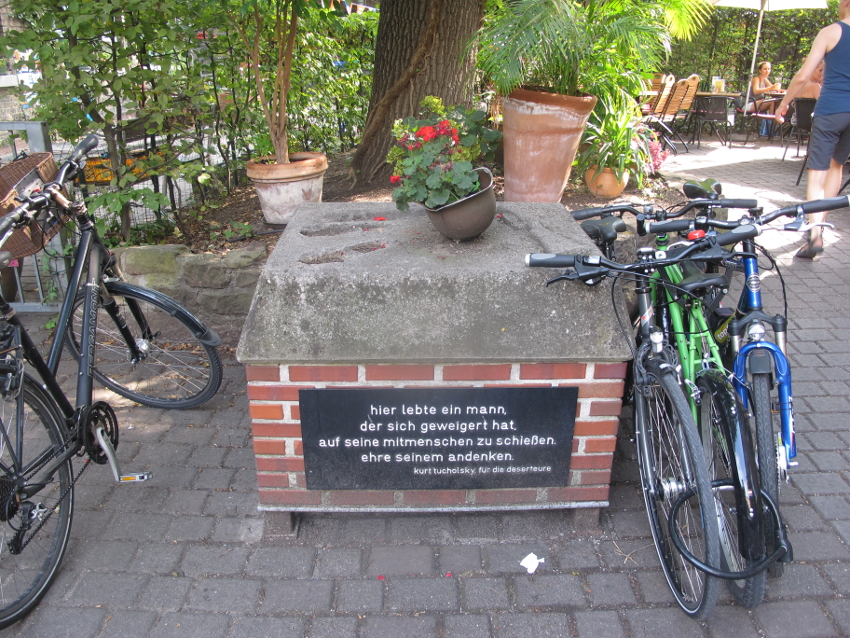

An zentraler Stelle im Gewerbehof am Eingang zum Café Palaver steht ein Denkmal zu Ehren von Deserteuren. Es besteht aus einem gemauerten Sockel, auf dem ein Soldatenhelm platziert wurde. Eine Texttafel auf der Vorderseite des Sockels trägt die Inschrift:

> hier lebte ein mann,
der sich geweigert hat,
auf seine mitmenschen zu schießen.
ehre seinem andenken.
kurt tucholski für die deserteure

Details zur Entstehungsgeschichte sind in einem [Blog-Artikel](http://friedensdenkmal-karlsruhe.de/index.php?option=com_k2&amp;view=item&amp;id=47:das-karlsruher-deserteursdenkmal&amp;Itemid=134) der Initiative _[Ein Friedensdenkmal für Karlsruhe](http://friedensdenkmal-karlsruhe.de)_ zusammengetragen worden. Weitere Infos finden sich auch in einem [Beitrag zum Stadtwiki Karlsruhe](http://ka.stadtwiki.net/Deserteurdenkmal).

# Zitat

Das Zitat entstammt dem Text *Die Tafeln* vom Kurt Tucholski, veröffentlicht unter seinem Pseudonym Ignaz Wrobel in
[Die Weltbühne](https://de.wikipedia.org/wiki/Die_Weltb%C3%BChne)
Nr. 16, S. 601 vom 21.04.1925 sowie im
[Prager Tagblatt](https://de.wikipedia.org/wiki/Prager_Tagblatt)
Nr. 96 Seite 3 vom 24.04.1925
(Einsehbar [hier](http://anno.onb.ac.at/cgi-content/anno?apm=0&aid=ptb&datum=19250424&seite=3) im Orginal).

### Die Tafeln

In Enghien – ganz recht: da, wo die großen Rennen stattfinden, in diesem pariser Vorort, der fiebernd darauf wartet, dass das große Kasino im See wieder eröffnet wird, wo jetzt das Spiel gesetzlich unterdrückt ist, wo es unter der Oberfläche rastlos arbeitet, um den Sumpf wieder aufzumachen; in Enghien, in dessen Nähe das schöne Montmorency liegt – in Enghien bin ich spazierengegangen, und da ist mir etwas Merkwürdiges aufgefallen.

Sie kennen doch die Schildchen, die in den kleinen Städten bei uns die Häuser zieren, wenn sie versichert sind: ›Providentia 1897‹ und ›Assecurancia 1904‹ und so. Und auch hier in Enghien hängen an vielen Häusern Tafeln, immer wieder, da eine, hier eine, große und kleine. Sie sind bunt, auf weißem Glasgrund sieht man ein paar Verzierungsblümchen und einen Text. Da steht:

> La ville d'Enghien
aux Héros de la Grande Guerre
Ici vécut le Caporal Marcel Laurent
tué pour la patrie en 1916

Was ist das –?

Das ist eine Erinnerung, ein Mahnzeichen, ein kleines Pflasterchen für die Frau und die Kinder, die der zurückgelassen hat. Und so viele –! Eine Glastafel – klack, ein trockner Gewehrschuß. Eine Glastafel – bumm – ein Volltreffer, nichts ist mehr von dem Mann übrig. Eine Glastafel – wumm – ein Paar Beine mit Stiefeln liegen unter einem Baum, wohin sie die Explosion geschleudert hat. An jedem zweiten Haus hängt die Tafel – manchmal stehen mehrere Namen darauf, zwei, drei, vier ... an beinah jedem Haus.

Ich gehe durch die Straßen und sehe auf einmal nur noch dies: nur noch die Tafeln und die zerschmetterten Köpfe, die auslaufenden Augen, die herausquellenden Lungen, die blutdurchtränkten schweren Reiterhosen, den Haufen Knochen, die verrostete Erkennungsmarke.

Die Tafeln sind eine Sitte wie jede andre auch, ein ehrendes Gedenkzeichen für die Toten. Aber die Tafeln lügen. Es muß nicht heißen: ›tué pour la patrie‹ – es muß heißen: ›tué par la patrie‹. Getötet durch diesen niedrigen Begriff ›Staat‹, getötet durch diesen Wahnsinn, der die Heimat, die jeder liebt, mit einem Nützlichkeitsbegriff verwechselt, der den meisten nicht einmal von Vorteil ist, sondern nur den wenigen. Stirbt man für eine Weizenagentur? Für eine Hypothekenbank? Man stirbt für und durch das Vaterland, und das kommt im wesentlichen auf dasselbe hinaus.

Tafeln, wie lange noch –? Wie lange noch lassen sich erwachsene Menschen einreden, dass eine sinnlose und anarchische Organisation zwischen den Staaten ein Recht hat, das Leben zu nehmen? Wie lange noch lassen sich Mütter die Söhne, Frauen die Geliebten, Kinder den Vater abschießen für eine Sache, die nicht die Kosten für den Mobilmachungsbefehl wert ist? Wie lange noch wird Mord sanktioniert, wenn der Mörder sich nur vorher eine Berufskleidung anzieht, seine Kanonen grau anstreicht, seine Gasbomben von der Kirche einsegnen läßt und sich überhaupt gebärdet wie der Statist einer Wagner-Oper?

Uns fehlen andre Tafeln. Uns fehlt diese eine:

> Hier lebte ein Mann, der sich geweigert hat,
auf seine Mitmenschen zu schießen.
Ehre seinem Andenken!

Ignaz Wrobel
