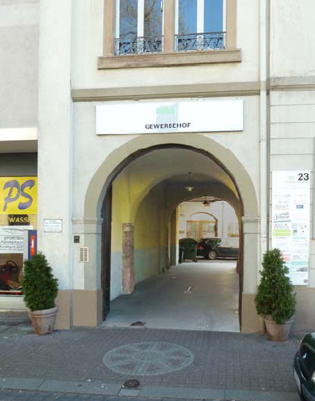

# Selbstverwaltetes alternatives Zentrum Karlsruhe

Der Gewerbehof Karlsruhe ist ein Selbstverwaltetes alternatives Zentrum
in Karlsruhe. Wir beherbergen verschiedene [Betriebe](betriebe/) und viele
[Organisationen und Vereine](organisationen/).

Im Gewerbehof steht auch ein
[Denkmal zum Gedenken an die Deserteure](deserteursdenkmal/).
Weiter Informationen zu unsere Geschichte und zu Leben und Arbeiten in
Selbstverwaltung findet ihr unter dem Punkt [über uns](ueber-uns/).

## Links zu befreundeten Seiten

- [Der Lidellplatz an den der Gewerbehof grenzt](http://www.lidellplatz.net/)
- [CONTRASTE- Monatszeitung für Selbstorganisation](http://www.contraste.org/)
 
