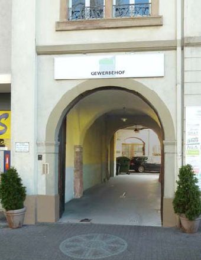

---
hide:
- toc
- footer
---

# Gewerbehof Karlsruhe

!!! abstract "Veranstaltungshinweis (Fahrrad-)Flohmarkt im Gewerbehof"

    **Am Samstag, 15. April 2023**, wird es einen Flohmarkt im gesamten Innenhof des Gewerbehofes geben.  
    **Schwerpunkt sind Fahrräder bzw. Fahrrad-Ersatzteile und Zubehör.**

    Zusätzlich werden einige Betriebe, Initiativen und Privatleute Stände aufbauen und unterschiedliche Dinge anbieten.

    > Ort: Steinstraße 23 ／ 76133 Karlsruhe  
    > Zeit: ca. 10-17 Uhr  
    > Kontakt: martin.hauge@danke-karl-drais.de ／ mail@klovesradeln.de

## Selbstverwaltetes alternatives Zentrum Karlsruhe

Der Gewerbehof Karlsruhe ist ein selbstverwaltetes alternatives Zentrum
in Karlsruhe. Wir beherbergen verschiedene [Betriebe](betriebe) und viele
[Organisationen und Vereine](organisationen).

Neuigkeiten, aktuelle Informationen und Veranstaltungshinweise gibt es unter [Aktuelles](aktuelles). 

Mehr Informationen zum Leben und Arbeiten in Selbstverwaltung findet ihr unter [Über Uns](ueber-uns),
mehr zu unserer Geschichte [hier](geschichte).

Im Gewerbehof steht auch ein [Denkmal zu Ehren von Deserteuren](deserteursdenkmal).
