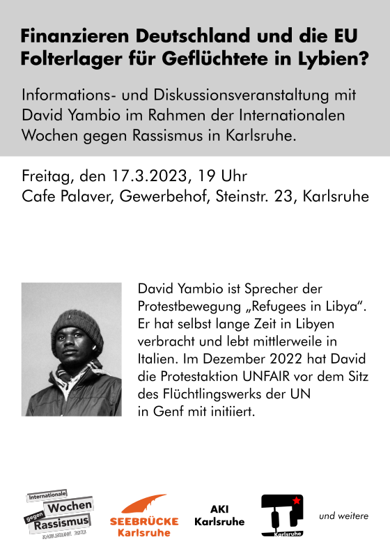
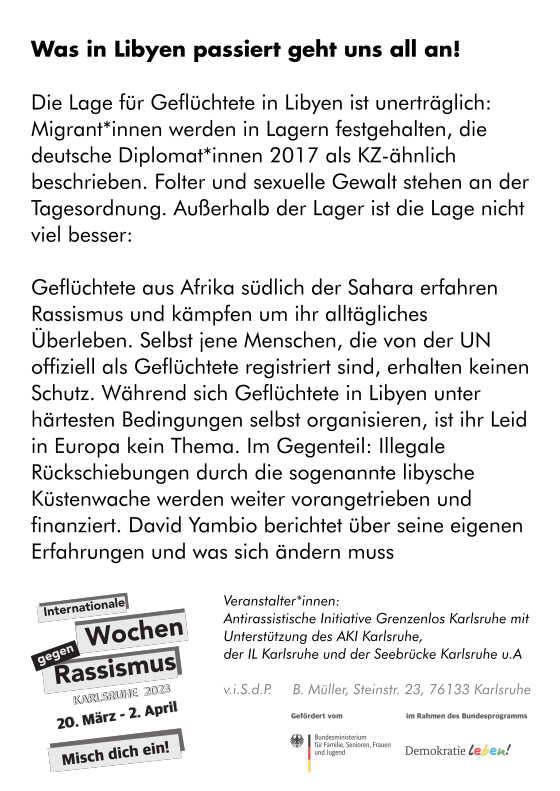

---
hide:
- toc
- footer
---

# Internationale Wochen gegen Rassismus

#### Was in Libyen passiert geht uns all an! – Finanzieren Deutschland und die EU Folterlager für Geflüchtete in Lybien?

Informations- und Diskussionsveranstaltung mit David Yambio im Rahmen der Internationalen Wochen gegen Rassismus in Karlsruhe.  
> Wo: Café Palaver im Gewerbehof ／ Steinstraße 23 ／ 76133 Karlsruhe  
> Wann: Freitag, 17. März 2023 ／ 19 Uhr  
> Kontakt: kontakt@iwgr-ka.de

_David Yambio ist Sprecher der Protestbewegung „Refugees in Libya“._  
_Er hat selbst lange Zeit in Libyen verbracht und lebt mittlerweile in Italien._  
_Im Dezember 2022 hat David die Protestaktion UNFAIR vor dem Sitz des Flüchtlingswerks der UN in Genf mit initiiert._

[Veranstaltungsbeschreibung bei Internationale Wochen gegen Rassismus](https://www.iwgr-ka.de/event/was-in-libyen-passiert-geht-uns-all-an-finanzieren-deutschland-und-die-eu-folterlager-fuer-gefluechtete-in-lybien/)
